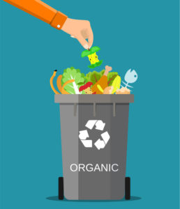
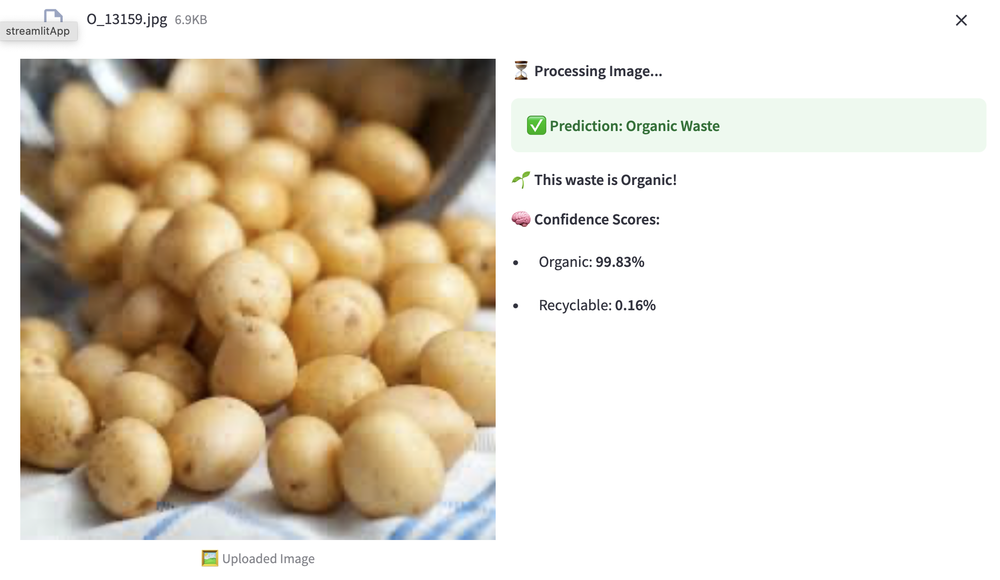
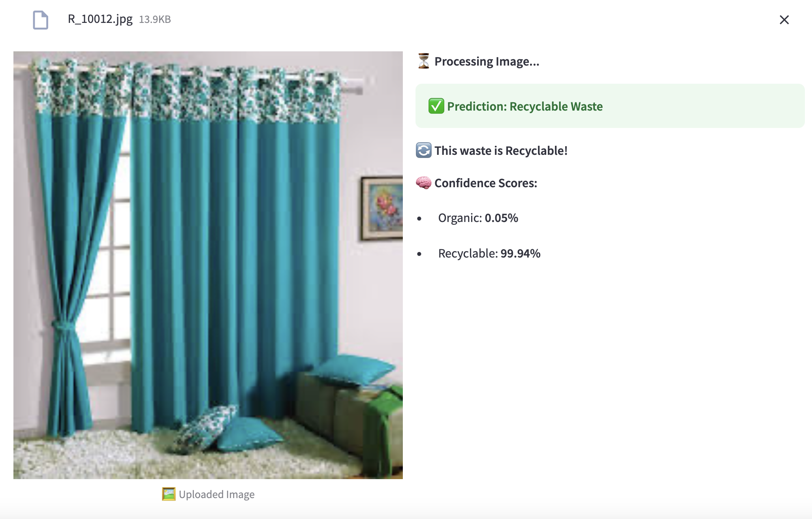

# CNN_WC
For training purposes!

---
♻️ Waste Classification using CNN & Streamlit

🚀 An AI-powered web app that classifies waste as Organic or Recyclable using a Convolutional Neural Network (CNN).

 
🔗 Live Demo: [Check it here!](https://wccnnrms.streamlit.app)

---
📌 About the Project

This project was developed as a part of AICTE Internship Training (Cycle 3). The model classifies waste images into Organic or Recyclable categories, contributing to environmental sustainability.

✨ Key Features

✅ CNN-Based Image Classification using TensorFlow
✅ Streamlit Web App for an interactive UI
✅ Real-time Image Upload & Prediction
✅ Google Drive Integration to load the trained model
✅ Responsive UI with animations

---

🛠 Tech Stack Used

🔹 Python - Programming Language
🔹 TensorFlow/Keras - Deep Learning Framework
🔹 Streamlit - Web App Framework
🔹 NumPy & Pillow - Image Processing
🔹 Google Drive & gdown - Model Storage & Retrieval

---

📂 Dataset & Model Information

	•	Dataset Provider: Techsash (Kaggle)
	•	Model Architecture & Description: Skills4future
	•	Trained on: Organic & Recyclable Waste Images
 
---

🎮 How to Run Locally

1️⃣ Clone the Repository

git clone https://github.com/RGS-AI/CNN_WC.git
cd CNN_WC

2️⃣ Install Dependencies

pip install -r requirements.txt
- **REDUCED** it from installing the full GPU version, which is heavy and unnecessary for cloud deployment.

3️⃣ Run the App

---

streamlit run app.py

🚀 Deploying on Streamlit Cloud

	1.	Push your project to GitHub
	2.	Go to Streamlit Cloud
	3.	Deploy the app using your repository
	4.	Done! 🎉
 
---
📸 Project Demo

 

    
 

  

    
 

Predicted Class
	🌱 Organic
	♻️ Recyclable
	

---

💡 **Acknowledgments**

🙏 Special thanks to:
- Techsash (Kaggle) for providing the dataset
- Skills4Future for model insights
- AICTE Internship Cycle 3 for the opportunity

📌 Trainer Credits: RMS 

📩 Connect with Me

📧 Email: 
🔗 LinkedIn: www.linkedin.com/in/raghunandanms

---
🎯 Now Go & Try the App! 🔥

🔗 👉 [Click here to access the live Streamlit App](https://wccnnrms.streamlit.app)
